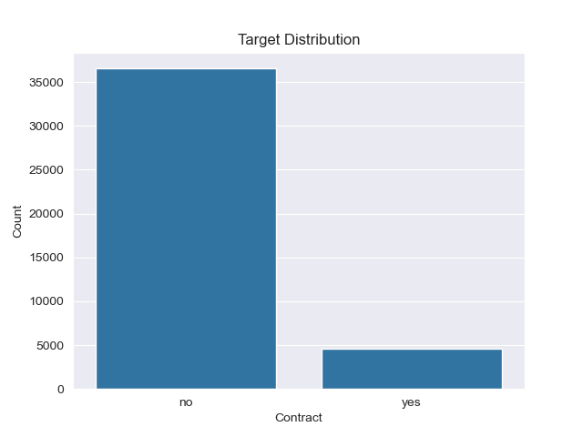
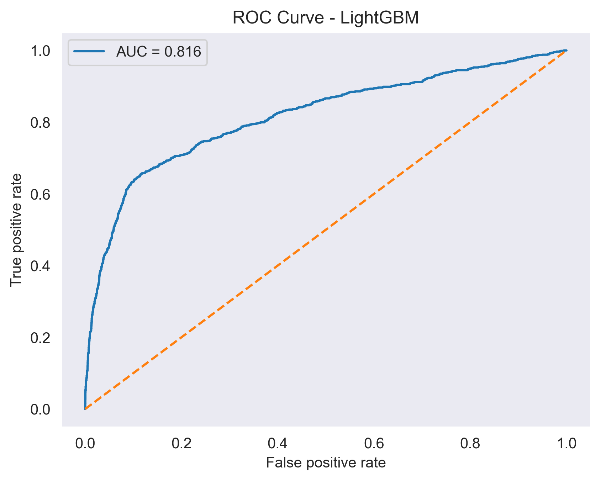
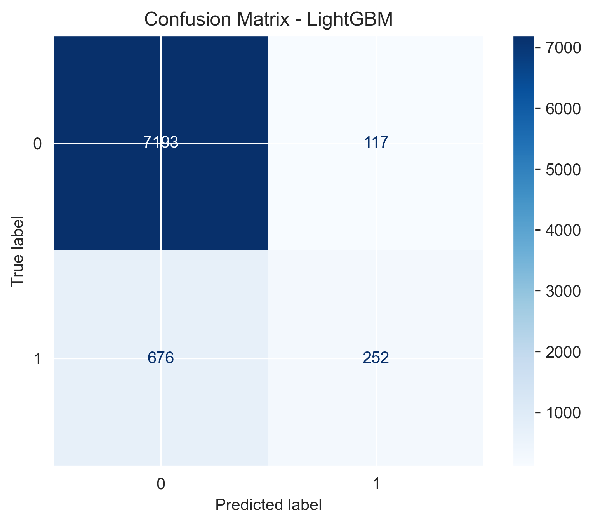
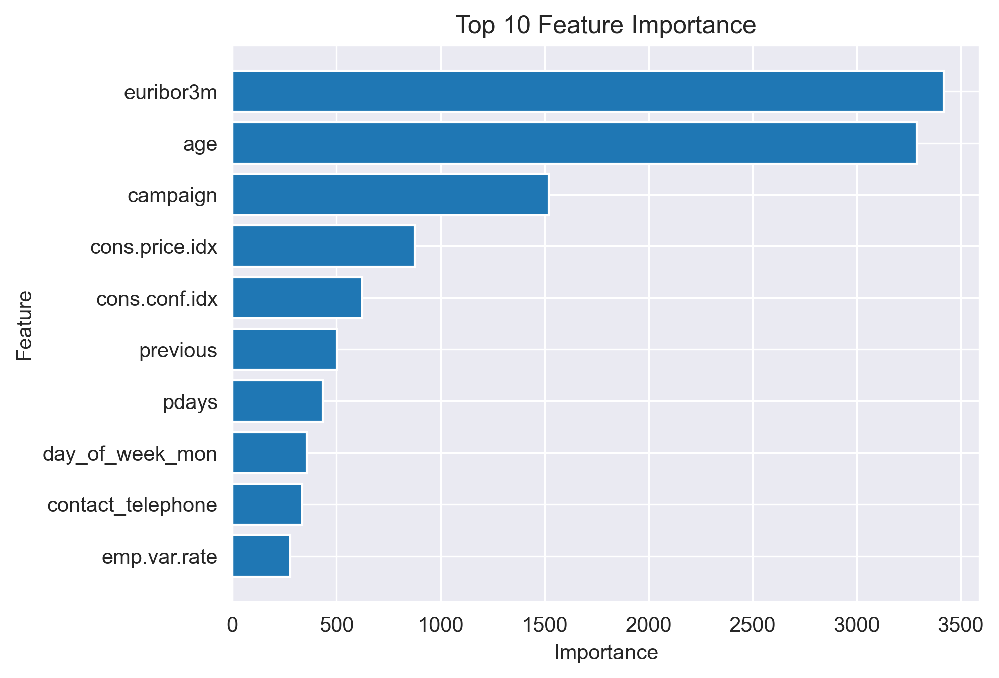
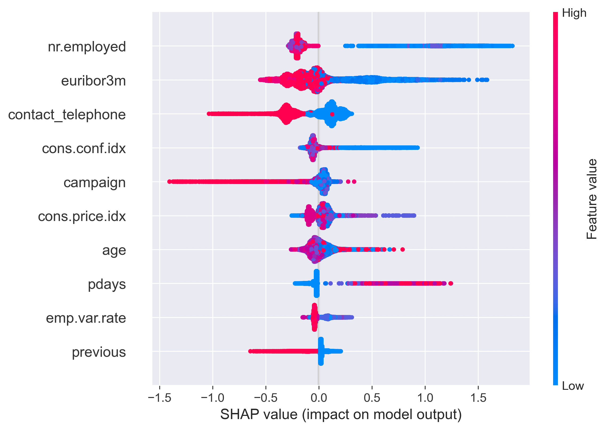

# Customer Conversion Prediction

## Overview
This project predicts whether a client will accept a bank offer (yes/no).

The dataset includes client information, campaign data, and economic indicators.
This is a binary classification problem.

---

## Target Distribution
The dataset is imbalanced, with more negative cases than positive ones.

---

## Models
- Logistic Regression
- k-Nearest Neighbors (kNN)
- Decision Tree
- LightGBM

---

## Model Comparison

| Model | Hyperparameters | Train ROC-AUC | Test ROC-AUC | Train F1 | Test F1 | Comment |
|-----------------------------|-------------------------------------|--------------:|-------------:|---------:|--------:|--------------------------------------|
| Logistic Regression (tuned) | C=1.0, class_weight=balanced | 0.795 | 0.800 | 0.434 | 0.388 | Good baseline, stable |
| kNN (k=80) | n_neighbors=80 | 0.920 | 0.788 | 0.480 | 0.317 | Overfitting reduced, but weaker |
| Decision Tree (depth=7) | max_depth=7 | 0.801 | 0.797 | 0.445 | 0.410 | Good balance, interpretable |
| LightGBM (Random Search) | RandomizedSearchCV tuned | 0.850 | 0.814 | 0.436 | 0.385 | Strong performance |
| LightGBM (Hyperopt) | Hyperopt tuned | 0.846 | 0.816 | 0.434 | 0.389 | Best overall model |

---

## Results
Best model: **LightGBM (Hyperopt)**

---

## ROC Curve

The ROC curve shows that the model can distinguish between classes quite well.
The AUC score is around 0.81, which indicates good performance.

---

## Confusion Matrix

The confusion matrix shows that the model predicts negative cases better than positive ones.
This explains the lower F1-score.

---

## Feature Importance

The chart below shows the most important features used by the model.

---

## SHAP Analysis

SHAP was used to explain model predictions. It shows how each feature affects the probability of a positive outcome.

---

## Error Analysis

The model often makes mistakes for:
- clients with no previous contact history
- cases where the effect of campaign is not clear

To improve the model, we can try creating new features or better processing the existing ones.
Another possible direction is applying SMOTE to better handle class imbalance.

---

## Tech Stack
- Python
- pandas
- scikit-learn
- LightGBM
- Hyperopt
- SHAP
- matplotlib

---

## Conclusion

In this project, I built and compared several machine learning models to predict customer conversion.

LightGBM showed the best performance among all models. Hyperparameter tuning slightly improved the results, but overall performance was limited by the data.

Class imbalance was handled using class weights and threshold tuning. SMOTE was considered as an alternative approach but was not included in the final version.

SHAP analysis helped to understand how different features affect the predictions.

Overall, this project demonstrates the full machine learning workflow: data analysis, model training, tuning, interpretation, and evaluation.
